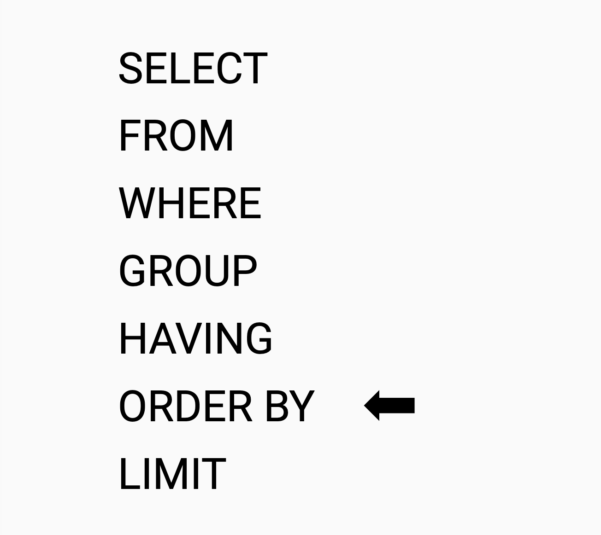

# Способы форматирования результатов запроса
<!-- TODO поправь перевод -->

??? info "Подключение к базе данных"
    
    Для отработки запросов используйте тренажер<br>
    <br>
    ссылка: [http://mysqldognition.online/phpmyadmin/](http://mysqldognition.online/phpmyadmin/)<br>
    логин: student<br>
    пароль: n123456789

В этом уроке мы узнаем о трех новых операторах SQL, которые помогут вам отформатировать вывод ваших запросов. Мы также узнаем, как экспортировать результаты ваших запросов в текстовый файл, чтобы вы могли анализировать их в других программных пакетах, таких как PowerBI или Excel.

Вспомним структуру. Теперь необходимо будет использовать новую конструкцию ORDER BY.


## AS для изменения заголовка столбца

Предложение AS позволяет вам назначить псевдоним (временное имя) таблице или столбцу в таблице.  Псевдонимы могут быть полезны для повышения удобочитаемости запросов, для сокращения длинных имен и для изменения заголовков столбцов в выходных данных запроса.  Чтобы реализовать предложение AS, включите его в код запроса сразу после столбца или таблицы, которые вы хотите переименовать.  Например, если вы хотите изменить название поля отметки времени таблицы completed_tests с "created_at" на "time_stamp" в ваших выходных данных, вы могли бы воспользоваться предложением AS и выполнить следующий запрос:

```SQL
SELECT dog_guid, created_at AS time_stamp
FROM complete_tests
```

Обратите внимание, что если вы используете псевдоним, содержащий пробел, псевдоним должен быть заключен в кавычки:

```SQL
SELECT dog_guid, created_at AS "time stamp"
FROM complete_tests
```

Вы также могли бы создать псевдоним для таблицы:

```SQL
SELECT dog_guid, created_at AS "time stamp"
FROM complete_tests AS tests
```

Поскольку псевдонимы являются строками, опять же, MySQL принимает как двойные, так и одинарные кавычки, но некоторые системы баз данных принимают только одинарные кавычки. Рекомендуется избегать использования ключевых слов SQL в ваших псевдонимах, но если вам по какой-либо причине необходимо использовать ключевое слово SQL в вашем псевдониме, строка должна быть заключена в обратные кавычки вместо кавычек.

### Вопрос 1

**Как изменить заголовок поля `start_time` из таблицы `exam_answers` при выводе?**

## DISTINCT чтобы убрать дуликаты

Особенно в таких базах данных, как база данных Dognition, где в каждой таблице не были объявлены первичные ключи, иногда целые повторяющиеся строки могут быть введены с ошибкой.  Даже при отсутствии повторяющихся строк иногда ваши запросы корректно выводят несколько экземпляров одного и того же значения в столбце, но вам интересно знать, каковы различные возможные значения в столбце, а не каково каждое значение в каждой строке. В обоих этих случаях лучший способ получить желаемые чистые результаты - это дать команду запросу возвращать только те значения, которые являются отличными или отличаются от всех остальных.  Ключевое слово SQL, которое позволяет вам это сделать, называется DISTINCT.  Чтобы использовать его в запросе, поместите его непосредственно после слова SELECT в вашем запросе.

Например, если бы нам нужен был список всех пород собак в базе данных Dognition, мы могли бы попробовать следующий запрос из предыдущего упражнения:

```SQL
SELECT breed
FROM dogs;
```

Однако вывод этого запроса был бы не очень полезен, поскольку он выводил бы запись для каждой отдельной строки в столбце breed таблицы dogs, независимо от того, дублировала ли она породу предыдущей записи.  К счастью, мы могли бы получить нужный нам список, выполнив следующий запрос с модификатором DISTINCT:


```SQL
SELECT DISTINCT breed
FROM dogs;
```

Если вы прокрутите выходные данные, то увидите, что нет двух одинаковых записей.  Следует отметить, что если вы используете предложение DISTINCT для столбца, который имеет нулевые значения, MySQL включит одно нулевое значение в выходные данные DISTINCT из этого столбца.

Когда предложение DISTINCT используется с несколькими столбцами в инструкции SELECT, комбинация всех столбцов вместе используется для определения уникальности строки в результирующем наборе.

Например, если вы хотите узнать все возможные комбинации штатов и городов в таблице users, вы можете запросить:

```SQL
SELECT DISTINCT state, city
FROM users;
```

Если вы внимательно изучите выходные данные запроса, то увидите, что в столбце штата есть много строк с Калифорнией (Калифорния) и четыре строки с Гейнсвиллом в столбце город (Джорджия, Арканзас, Флорида и Вирджиния имеют города с именем Гейнсвилль в нашей пользовательской таблице), но ни в одной из двух строк нет Гейнсвилля в столбце город). то же сочетание штата и города. 

Когда вы используете предложение DISTINCT с предложением LIMIT в инструкции, MySQL прекращает поиск, когда находит количество *уникальных* строк, указанных в предложении LIMIT, а не когда просматривает количество строк в предложении LIMIT. 

Например, если первые 6 записей столбца порода в таблице собаки были:

Labrador Retriever  
Shetland Sheepdog  
Golden Retriever  
Golden Retriever  
Shih Tzu  
Siberian Husky  

Результат следующего запроса:

```SQL
SELECT DISTINCT state, city
FROM users;
```

это были бы первые 5 различных пород:

Labrador Retriever  
Shetland Sheepdog  
Golden Retriever  
Shih Tzu  
Siberian Husky  

*не* различные породы в первых 5 рядах:

Labrador Retriever  
Shetland Sheepdog  
Golden Retriever  
Shih Tzu  

### Вопрос 2

**Напишите запрос, который покажет все возможные комбинации названий тестов `test_name` и подкатегорий `subcategory_name` из таблицы `complete_tests`?**

## ORDER BY для сортировки результатов запроса

Как вы, возможно, уже заметили, изучая выходные данные запросов, которые вы выполнили до сих пор, базы данных не имеют встроенных механизмов сортировки, которые автоматически сортируют выходные данные вашего запроса.  Однако SQL разрешает использование мощного предложения ORDER BY, позволяющего вам сортировать выходные данные в соответствии с вашими собственными спецификациями.  Давайте посмотрим, как бы вы реализовали простое предложение ORDER BY.

Ваше предложение ORDER BY будет указано после всего остального в основной части вашего запроса, но перед предложением LIMIT.  

Если вы хотите, чтобы породы собак в таблице dog были отсортированы в алфавитном порядке, вы могли бы запросить:

```SQL
SELECT DISTINCT breed
FROM dogs 
ORDER BY breed
```

По умолчанию выходные данные сортируются в порядке возрастания.  Однако вы можете указать SQL также отсортировать выходные данные в порядке убывания:

```SQL
SELECT DISTINCT breed
FROM dogs 
ORDER BY breed DESC
```

Сочетание ORDER BY с LIMIT дает вам простой способ выбрать "топ-10" и "последние 10" в списке или столбце.  Например, вы могли бы выбрать идентификаторы пользователей и идентификаторы собак из 5 пар клиент-собака, которые потратили наименьшее среднее количество времени между тестами на распознавание:

```SQL
SELECT DISTINCT user_guid, median_ITI_minutes
FROM dogs 
ORDER BY median_ITI_minutes
LIMIT 5
```

или наибольший средний промежуток времени между их тестами на распознавание:

```SQL
SELECT DISTINCT user_guid, median_ITI_minutes
FROM dogs 
ORDER BY median_ITI_minutes DESC
LIMIT 5
```

Вы также можете отсортировать свои выходные данные на основе производного поля. Если вы хотите, чтобы интервал между тестами выражался в секундах, а не в минутах, вы могли бы включить производный столбец и псевдоним в свой последний запрос, чтобы получить 5 пар "клиент-собака", которые потратили наибольшее среднее количество времени между тестами распознавания в секундах:

```SQL
SELECT DISTINCT user_guid, (median_ITI_minutes * 60) AS median_ITI_sec
FROM dogs 
ORDER BY median_ITI_sec DESC
LIMIT 5
```

Обратите внимание, что круглые скобки важны в этом запросе; без них база данных попыталась бы создать псевдоним для 60 вместо median_ITI_minutes * 60.

SQL-запросы также позволяют выполнять сортировку по нескольким полям в указанном порядке, аналогично тому, как Excel позволяет включать в сортировку несколько уровней (см. изображение ниже).:

```SQL
SELECT DISTINCT user_guid, state, membership_type
FROM users
WHERE country="US"
ORDER BY state ASC, membership_type ASC
```

Чтобы достичь этого в SQL, вы включаете все поля (или псевдонимы), по которым вы хотите отсортировать результаты, после предложения ORDER BY, разделенные запятыми, в том порядке, в котором вы хотите, чтобы они использовались для сортировки.  Затем вы можете указать после каждого поля, хотите ли вы, чтобы сортировка по этому полю была по возрастанию или по убыванию.

Если вы хотите выбрать все отдельные идентификаторы пользователей клиентов в Соединенных Штатах (сокращенно "US") и отсортировать их в соответствии со штатами, в которых они проживают, сначала в алфавитном порядке, а затем по типу членства, вы могли бы запросить:

```SQL
SELECT DISTINCT user_guid, state, membership_type
FROM users
WHERE country="US" AND state IS NOT NULL and membership_type IS NOT NULL
ORDER BY state ASC, membership_type ASC
```

### Вопрос 3

**Напишите запрос, который покажет все возможные комбинации названий тестов `test_name` и подкатегорий `subcategory_name` из таблицы `complete_tests`?**

<!-- TODO экспорт -->

## REPLACE и TRIM для обработки вывода

Возвращает строку str со всеми вхождениями строки from_str, замененными строкой to_str. Функция REPLACE() выполняет сопоставление с учетом регистра при поиске from_str."

Одна вещь, которую мы могли бы попробовать, - это использовать эту функцию для замены любых тире, включенных в названия пород, без символов:

```SQL
SELECT DISTINCT breed,
REPLACE(breed,'-','') AS breed_fixed
FROM dogs
ORDER BY breed_fixed
```

В этом запросе мы помещаем имя поля/столбца в функцию replace, где в синтаксических инструкциях указано "str", чтобы указать функции REPLACE действовать со всем столбцом.  "-" было "from_str", то есть строкой, которую мы хотели заменить.  "" был to_str, который является символом, которым мы хотим заменить "from_str".

Это было полезно, но вы все равно заметите некоторые проблемы с выводом.

Во-первых, начальные тире действительно удалены в столбце breed_fixed, но теперь тире, используемые для разделения пород в таких записях, как "Смесь французского бульдога и бостонского терьера", также отсутствуют. Таким образом, ЗАМЕНА - неправильный выбор для выборочного удаления начальных тире.

Возможно, мы могли бы попробовать использовать функцию TRIM:

```SQL
SELECT DISTINCT breed, TRIM(LEADING '-' FROM breed) AS breed_fixed
FROM dogs
ORDER BY breed_fixed
```

## Практика темы 3

### Вопрос 4

**Как запросить список всех подкатегорий тестов `subcategory_name` из таблицы `complete_tests` в алфавитном порядке, чтобы ни одна категория теста не была указана более одного раза?**

### Вопрос 5

**Как запросить список всех стран, кроме Соединенных Штатов (значение `country` _US_) из таблицы `users`, откуда пользователи Dognition регистрировались? Страны в списке указаны не более одного раза.**

### Вопрос 6

**Введите запрос, который покажет уникальные идентификаторы пользователей `user_guid`, идентификаторы собак `dog_guid` и название теста `test_name` первых 10 тестов из таблицы `complete_tests`, которые были созданы в базе данных dognition_db (дата создания `created_at`)?**
