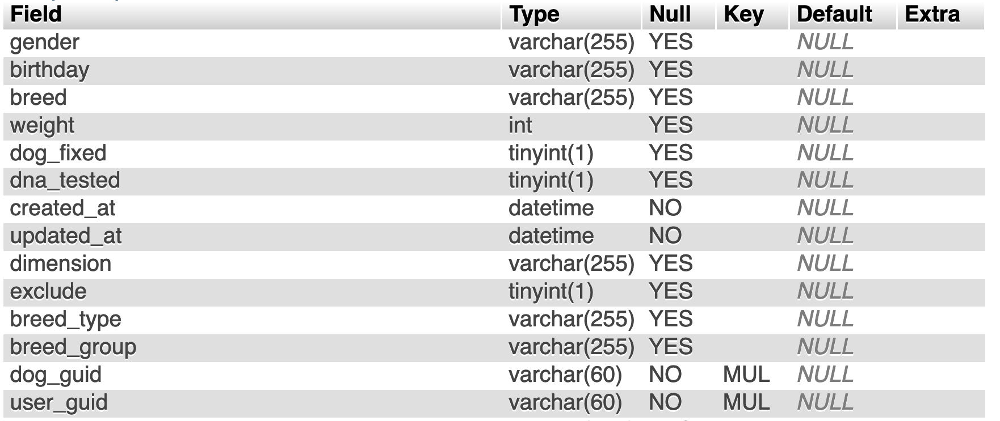

# Занятие 1: Добро пожаловать в MySQL

## Среда для выполнения запросов

Интерфейсы баз данных сильно различаются в зависимости от платформы и компании. Интерфейс, который вы здесь будете использовать, называется `phpMyAdmin`, представляет собой веб-приложение, для администрирования систему управления базами данных `MySQL`. Данный ресурс выбран в связи с его доступностью и удобством написания синтаксиса sql-запроса.

??? info "Какие SQL бывают?"

    Примеры коммерческих реализаций SQL:

    * MySQL,
    * Microsoft SQL Server,
    * PostgreSQL,
    * Oracle.
  
    Многообразие коммерческих реализаций SQL объясняется тем, что каждая компания выбирает СУБД в зависимости от своих потребностей и бюджета. Коммерческие реализации SQL отличаются функциональностью, производительностью, масштабируемостью и стоимостью. Например, `MySQL` и `PostgreSQL` бесплатны и доступны для использования в открытых проектах, в то время как `Microsoft SQL Server` и `Oracle` предлагают расширенные функции и поддержку для крупных компаний и организаций. Выбор конкретной реализации зависит от требований проекта, бюджета и опыта команды разработчиков.

    Для удобной работы с базой данных, реализации SQL имеют свои СУБД — системы управления базами данных. Она позволяет создавать, объединять, удалять информацию в базах данных, предоставлять доступ определённым пользователям и защищать данные от взлома.

## База данных Dognition


[Dognition](https://www.dognition.com/) — это проект для владельцев собак, который позволяет проводить развивающие игры на базе лабораторных исследований доктора Хэира и его собаки Тасмании. Проект представляет собой веб-сервис, который содержит набор испытаний для вашего питомца для изучения его способностей.

В этом курсе мы будем практиковаться в написании SQL-запросов на базе набора данных Dognition в блокнотах Jupyter Блокнот включает пошаговые инструкции в письменном виде и примеры кода. Затем, когда вы освоитесь с синтаксисом запроса, вы попрактикуетесь в самостоятельном написании запроса под заданный сценарий.

## Подключени к базе данных

Для того, чтобы начать писать запросы к базе данных MySQL, вы можете перейти к тренажеру, который представляет собой запущенную на сервере систему управления базами данных (`СУБД`).

1 - В браузере перейдите по ссылке: [http://mysqldognition.online/phpmyadmin/](http://mysqldognition.online/phpmyadmin/)


2 - Введите следующие данные в качестве логина и пароля:

??? info

    логин: student<br>
    пароль: n123456789

Откроется следующее окно


3 - Выберите интересующую базу данных на панели слева.

    * `dognition_db` — разобрана в качестве примере в данном материале
    * `ranepa_distant/designer_store` — используются для самостоятельной работы

4 - Перейдите на вкладку SQL. В открывшемся окне вы можете писать SQL запросы.


??? info "Дополнительные функции"

    phpmyadmin представляет инструменты для более подробной работы с базой данных. Одним из них является режим Дизайнера. Он автоматически строит реляционную схему выбранной базы. Для того, чтобы им воспользоваться, выберите базу данных и на панели вкладок раскройте пункт "Еще" и выберите инструмент "Дизайнер". 

    
    
    
    Всегда проверяйте какая база данных у вас открыта. Если SQL запрос перестал работать, убедитесь, что вы не перешили в таблицу или другую БД. Если это произошло, просто заново откройте необходимую базу данных на панели слева.

    

## SHOW для просмотра данных в базе данных Dognition

Когда вы начинаете работать с новыми данными, для начала необходимо с ними ознакомится.

Наборы данных (или часто их называют Датасеты (Datasets)), с которыми вы будете работать будут достаточно объемными. Если вы просто начнете делать запросы, не зная, что вы извлекаете, сервер, к которому вы обращаетесь, может "упасть" или загрузиться на столько, что понадобится очень долго ждать выполнения запроса.<br>Поэтому, даже если у вас есть реляционная схема базы данных, перед тем как вы начнете вводить запросы, рекомендуется выполнить следующие шаги:
1. уточнить количество таблиц в базе данных;
2. определить поля и типы данных, содержащиеся в каждой таблице базы данных.

Чтобы определить количество таблиц в каждой базе данных, используйте команду `SHOW`:

```SQL
SHOW tables
```

Вывод, который появляется выше, должен показать вам, что в базе данных Dognition есть шесть таблиц.

Чтобы определить, какие столбцы (также вы можете встретить названия поля, признами, атрибуты) находятся в каждой таблице, вы можете снова использовать команду SHOW, но на этот раз:

1. вы должны указать, что необходимо отобразить столбцы вместо таблиц; 
2. вы должны указать, из какой таблицы необходимо вывести столбцы.

Синтаксис, который звучит очень похоже на то, что вы бы сказали на разговорном английском, выглядит следующим образом:

если у вас уже выбрана база данных:

```SQL
SHOW columns FROM table 
```

или если у вас загружено несколько баз данных:

```SQL
SHOW columns FROM table FROM database
```

или еще один вариант:

```SQL
SHOW columns FROM databasename.tablename
```

### Правила написания запросов

Обратите внимание, что в примерах запросов часть команд записано в ВЕРХНЕМ РЕГИСТРЕ, а часть – в нижнем. Такой стиль упрощает чтение и позволяет легче устранять легкие неполадоки в запросе.<br>
Вы можете написать запрос полностью в нижнем регистре – это не будет ошибкой, но для упрощения чтения рекомендуется использовать такой стиль.<br>
Будте внимательны! Названия колонок, таблиц и баз данных необходимо писать в том регистре, в котором они указаны.<br>

`dognition_db` и `Dognition_DB` – разные базы данных!

В этом курсе мы будем использовать только самые важные ключевые слова SQL, но полный список можно найти [по ссылке](https://dev.mysql.com/doc/refman/5.5/en/keywords.html).

### Вопрос 1

Сколько столбцов в таблице `dogs`? Введите соответствующий запрос.

### DESCRIBE

Альтернативный способ узнать ту же информацию - использовать функцию DESCRIBE.

```SQL
DESCRIBE tablename
```

### Информация о таблице



Функции `SHOW` и `DESCRIBE` предоставляют гораздо больше информации о таблице, чем просто количество столбцов или полей. Действительно, первый столбец `Field` показывает заголовок каждого поля в таблице. Столбец `Type` описывает, какой тип данных хранится в этом столбце. Ниже приведена таблица с обозначениями различных типов данных.

|Обозначени|Тип данных SQL|
|:---|:---|
|int|Число|
|char()|строка маленького объема (2 байта)|
|varchar()|строка до 255 символов|
|text|строка более 255 символов|
|float|число с плавающей точкой|
|date|дата (3 байта)|
|datetime|дата и время (8 байт)|
|timestamp|время|
|tinyint()|число (2 байта)|
|bool|логический тип данных|

Подробнее о типах данных [по ссылке](https://www.hostgator.com/help/article/mysql-variable-types)

Следующий столбец `Null` указывает, можно ли сохранять нулевые значения в поле таблицы. Столбец `Key` предоставляет информацию о первичных и внешних ключах:
* `PRI`: столбец является ПЕРВИЧНЫМ КЛЮЧОМ или одним из них.
* `UNI`: столбец уникальных значений.
* `MUL`: столбец неуникальных значений, в котором разрешено несколько вхождений данного значения в столбце.

Поле `Default` указывает значение по умолчанию, которое присвоено полю. Поле `Extra` содержит любую дополнительную информацию, которая доступна о данном поле в этой таблице.

#### Отсутствие первичных ключей

Изучая поля в каждой таблице, вы заметите, что ни в одной из таблиц `dognition_db` не объявлены первичные ключи. Но вы могли заметить, что в некоторых полях в столбце `Key` вывода `DESCRIBE` указано `MUL`, поскольку эти столбцы все еще можно использовать для связи таблиц. Тем не менее важно помнить, что значения в таком столбце могут содержать значения NULL или повторяющиеся строки, поэтому их не всегда можно сделать первичными ключами.

### Вопрос 2

В ячейках ниже проверьте поля в других 4 таблицах базы данных `dognition_db`.

## SELECT для просмотра строк таблицы

Как только вы получите представление о том, как выглядят таблицы в базе данных и как они могут могут быть связаны друг с другом, самое время начать изучать "сырые" данные, то есть те, которые находятся в таблице без предварительной фильтрации и сортировки. Данный шаг необходим для того, чтобы узнать какие значения встречаются в таблицах и какие могут быть проблемы для дальнейшего анализа. Для этого мы будем использовать, пожалуй, самый важный оператор SQL для аналитиков: оператор `SELECT`.

`SELECT` используется тогда, когда необходимо получить данные из таблицы. Чтобы получить эти данные, вы всегда должны указывать:

1. что вы хотите выбрать;
2. откуда вы хотите это выбрать.
   
Каркас оператора SELECT выглядит так:

```SQL
SELECT
FROM
```

Рекомендуется всегда форматировать запрос SQL так, чтобы два разных оператора располагались на отдельных строках, чтобы запрос можно было легко прочитать. Не является ошибкой, если запрос будет записан в одну строку, для удобства чтения, лучше расположить их на разных, как показано в примере.

```SQL
SELECT breed
FROM dogs;
```

Точка с запятой `;` в конце запроса требуется только в том случае, если у вас есть несколько отдельных запросов, сохраненных в одном текстовом файле или редакторе. Тем не менее, рекомендуется включать точку с запятой в конце ваших запросов всегда.

Cтрока в верхней части панели вывода с надписью _35050 rows_. Это означает, что в таблице Dogs 35050 строк данных. В каждой строке указано название породы собаки, которая была внесена в базу данных. Обратите внимание, что названия некоторых пород указаны несколько раз, так как разные собаки могут одной и той же породы.

## LIMIT для ограничения количества строк в выводе

В конце вывода, вы увидите, что количество строк усечено. Это сделано для того, чтобы сервер с базой данных не был перегружен. Однако в реальном сценарии таких ограничений может не быть (например, если вы запрашиваете данные из терминала). Поэтому при запросе "сырых" данных необходимо ограничить количество строк при выводе.

Оператор, который ограничивает вывод строк, называется `LIMIT`, и он всегда помещается в самый конец вашего запроса. Простейшый вариант использования оператора `LIMIT` выглядит так:

```SQL
SELECT breed
FROM dogs 
LIMIT 5;
```

### Вопрос 3

Введите запрос, который позволит вам увидеть первые 20 городов из столбца `city` в таблице `users`.

Вы также можете выбирать строки данных из разных частей выходной таблицы, а не всегда просто начинать с самого начала.  Чтобы сделать это, используйте предложение OFFSET после LIMIT. Число после предложения OFFSET указывает, с какой строки будет начинаться запрос выходных данных.  Обратите внимание, что смещение строки 1 таблицы на самом деле равно 0.  Поэтому в следующем запросе:

```SQL
SELECT breed
FROM dogs LIMIT 10 OFFSET 5;
```

Альтернативным способом записи предложения OFFSET в запросе является:

```SQL
SELECT breed
FROM dogs LIMIT 5, 10;
```

Команда LIMIT - это одна из частей синтаксиса, которая может варьироваться в зависимости от платформы базы данных.  MySQL использует LIMIT для ограничения выходных данных.

## SELECT для запроса нескольких столбцов

Теперь, когда мы знаем, как ограничить наш вывод, мы готовы немного усложнить работу нашего оператора SELECT.  Оператор SELECT может использоваться как для выбора нескольких столбцов, так и для выбора одного столбца.  Результат запроса будет зависеть от порядка столбцов, которые вы вводите после инструкции SELECT в вашем запросе.  При вводе имен столбцов разделяйте каждое имя запятой, но не ставьте запятую после последнего имени столбца.

Попробуйте выполнить следующий запрос с разным порядком имен столбцов, чтобы заметить различия в выходных данных (я включу оператор LIMIT во многие примеры, которые использую в остальной части курса, но не стесняйтесь изменять или удалять их, чтобы изучить различные аспекты данных):**

```SQL
SELECT breed, breed_type, breed_group
FROM dogs LIMIT 5, 10;
```

Еще одна хитрость, о которой следует знать при использовании SELECT, заключается в том, что вы можете использовать звездочку `*` в качестве "подстановочного знака" для возврата всех данных в таблице. Обратите внимание, это очень рискованно делать, если вы не ограничиваете свой вывод или если вы не знаете, сколько данных содержится в вашем запросе. база данных, поэтому используйте подстановочный знак с осторожностью. Однако это удобный инструмент для использования, когда у вас нет легкодоступных имен столбцов или когда вы знаете, что хотите запросить всю таблицу целиком.  

Синтаксис следующий:

```SQL
SELECT *
FROM dogs LIMIT 5, 10;
```

Оператор SELECT позволяет также выполнять вычисления над выбранными столбцами при помощи арифметических операторов «+», «-», «*», «/». Например, если вам нужны значения интервалы между тестами в часах, а не в минутах или днях, вы можете ввести следующий запрос:

```SQL
SELECT median_iti_minutes / 60
FROM dogs LIMIT 5, 10;
```

Это не единственные вычислительные операции, которые можно производить с колонками. Существуют также функции для агрегации значений. О них будет подробно рассказано на занятии 4.<br>
Сейчас рассмотрим функцию `COUNT`, которая позволяет нам посчитать количсество строк в колонке.

```SQL
SELECT COUNT(breed)
FROM dogs;
```

Тоже самое можно получить, если в скобочках поставить подстановочный символ _*_.

```SQL
SELECT COUNT(*)
FROM dogs;
```

### Вопрос 4

Как запросить все данные из таблицы `rewievs`?<br>
Ограничьте вывод строк до 100 значения!

Мы разбрали синтаксические конструкции SELECT, FROM и LIMIT, но запрос данных имеет гораздо более широкую структуру. В следующих блоках будут разобраны следующие конструкции.


## Практика темы 1

### Вопрос 5

Напишите запрос, который выведет вам первые 15 строк столбцов `dog_guid`, `subcategory_name`, `test_name` из таблицы `reviews`.

### Вопрос 6

Как получить 10 строк из колонок `activity_type`, `created_at`, и `updated_at` из таблицы `site_activities`, начиная с 50 строки?

### Вопрос 7

Как получить 20 строк из всей таблицы `users`, начиная с 2000 строки?
