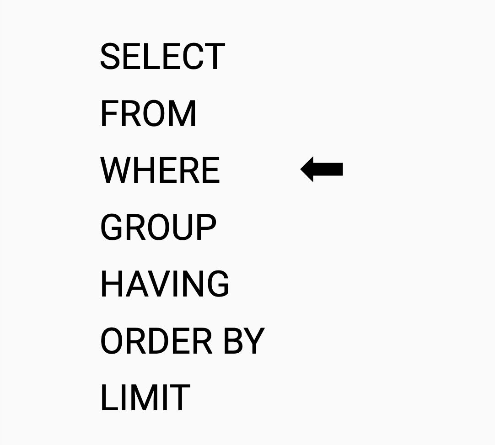

# Использование WHERE для выбора данных
<!-- TODO поправь перевод -->
<!-- TODO добавь задания про timediff-->

??? info "Подключение к базе данных"
    
    Для отработки запросов используйте тренажер<br>
    <br>
    ссылка: [http://mysqldognition.online/phpmyadmin/](http://mysqldognition.online/phpmyadmin/)<br>
    логин: student<br>
    пароль: n123456789

## Where для определения условий запроса

### Структура SQL-запроса

Структура написания запроса для получения данных выглядит так.



Таким образом, когда данные необходимо отфильтровать по заданному критерию, необходимо использовать оператор `WHERE` с указанием условия фильтрации.<br>
Обратите внимание, что `WHERE` указывается после `FROM`!

Допустим, необходимо узнать, какие клиенты Dognition получили бесплатный доступ в приложении Dognition. У этих клиентов есть 1 в столбце `free_start_user` таблицы `users`. Тогда запрос будет выглядить следующим образом.

```SQL
SELECT user_guid
FROM users
WHERE free_start_user=1;
```

Если вы хотите перепроверить, действительно ли выводимые данные соответствуют указанным вами критериям, вы могли бы включить в свои выходные данные второй столбец, который давал бы вам значение в поле free_start_user для каждой строки выходных данных.

```SQL
SELECT user_guid, free_start_user
FROM users
WHERE free_start_user=1;
```

### Вопрос 1

**Как получить информацию об идентификаторах собак `dog_guid`, у которых взяли тест на ДНК (значение 1 в поле `dna_tested` из таблицы `dogs`)?**

## Операторы сравнения и WHERE

Наиболее распространенные операторы сравнения включают: `=, <,>, <= и >=`. Если вы хотите выбрать что-то, что НЕ является конкретным значением, используйте `!=` или `<>`. Вы также можете использовать логические операторы, такие как AND и OR.

Если бы вы хотели изучить логику поведения собак, которые весили от 10 до 50 фунтов, вы могли бы запросить:

```SQL
SELECT dog_guid, weight
FROM dogs
WHERE weight BETWEEN 10 AND 50;
```

Приведенный выше запрос предоставил пример того, как использовать оператор `BETWEEN` (описанный в приведенных выше ссылках), а также пример того, как И может использоваться для указания нескольких критериев.  Если вы хотите вывести список собак, которые были стерилизованы ИЛИ протестированы на ДНК, вы можете использовать ИЛИ в следующем запросе.

```SQL
SELECT dog_guid, dog_fixed, dna_tested
FROM dogs
WHERE dog_fixed=1 OR dna_tested=1;
```

Если вы посмотреть собак, которые были стерилизованы, но НЕ прошли тест ДНК, вы могли бы запросить:

```SQL
SELECT dog_guid, dog_fixed, dna_tested
FROM dogs
WHERE dog_fixed=1 AND dna_tested!=1;
```

### Вопрос 2

**Напишите запрос, который выведет информацию об идентификаторах пользователей `user_guid` из таблицы `users`, которые оформили годовые подписки (значение _2_ в `membership_type`)?**

Теперь давайте попробуем использовать оператор WHERE для взаимодействия с текстовыми данными (называемыми "строками").

В SQL строки должны быть заключены в кавычки.  MySQL принимает как двойные, так и одинарные кавычки, но некоторые системы баз данных принимают только одинарные кавычки.  Всякий раз, когда строка содержит ключевое слово SQL, строка должна быть заключена в обратные кавычки вместо кавычек.

`'знаки, окружающие эту фразу, заключены в одинарные кавычки'`
`"знаки, окружающие эту фразу, заключены в двойные кавычки"`

Строки, заключенные в кавычки или обратные кавычки, могут использоваться со многими из тех же операторов, что и числовые данные.  Например, представьте, что вы хотели просмотреть данные только о собаках породы "Золотистые ретриверы".  Вы могли бы запросить (обратите внимание, что в этом примере вполне могли быть использованы двойные кавычки).

```SQL
SELECT dog_guid, breed
FROM dogs
WHERE breed='golden retriever';
```

Оператор IN позволяет вам указать несколько значений в предложении WHERE.  Каждое из этих значений должно быть отделено запятой от других значений, а весь список значений должен быть заключен в круглые скобки.  Если бы вы хотели просмотреть все данные по золотистым ретриверам и пуделям, вы, конечно, могли бы использовать оператор OR, но оператор IN был бы еще более эффективным (обратите внимание, что в этом примере также можно было бы использовать одинарные кавычки).

```SQL
SELECT dog_guid, breed
FROM dogs
WHERE breed IN ("golden retriever","poodle");
```

Оператор LIKE позволяет вам указать шаблон, которому должны соответствовать запрашиваемые текстовые данные.  Например, если вы хотите просмотреть все данные по породам, названия которых начинаются на "s", вы можете запросить.

```SQL
SELECT dog_guid, breed
FROM dogs
WHERE breed LIKE ("s%");
```

В этом синтаксисе знак процента указывает на подстановочный знак.  Подстановочные знаки представляют собой неограниченное количество пропущенных букв.  Вот как размещение знака процента повлияло бы на результаты запроса:

* WHERE breed LIKE ("s%") -> порода должна начинаться с "s", но может иметь любое количество букв после "s"
* WHERE breed LIKE ("%s") -> порода должна заканчиваться на "s", но может иметь любое количество букв перед "s"
* WHERE breed LIKE ("%s%") -> порода должна содержать где-нибудь в названии "s", но может иметь любое количество букв до или после "s"

### Дополнительно о шаблонах LIKE

В `LIKE` можно задавать не только любое количество символов после запятой, а уточнить запрос. Например,

|Шаблон|Описание|
|:--|:--|
|'abc%' | Любые строки, которые начинаются с букв «abc»|
|'abc_' | Строки длиной строго 4 символа, причем первыми символами строки должны быть «abc»|
|'%z' | Любая последовательность символов, которая обязательно заканчивается символом «z»|
|'%Rostov%' | Любая последовательность символов, содержащая слово «Rostov» в любой позиции строки|
|'% % %' | Текст, содержащий не менее 2-х пробелов, например, "World Wide Web"|

Попробуем запросить всех собак, порода которых начинается с символа "S", второй символ неизвестен, третий будет "o", а далее могут быть любые символы.

```SQL
SELECT dog_guid, breed
FROM dogs
WHERE breed LIKE ("S_o%");
```

Предикант `LIKE` можно комбинировать с оператором `AND`. Если необходимо запросить идентификаторы собак, порода которых начинается с символа "S" и содержит любые символы после, но не содержит символ "h" на второй позиции, то можно составить следующий запрос.

```SQL
SELECT dog_guid, breed 
FROM dogs 
WHERE breed LIKE ("S%") AND 
    breed NOT LIKE ("_h%");
```

### Вопрос 3

**Как бы вы запросили все данные о пользователях из таблицы `users`, которые находятся в штате Северная Каролина или Нью-Йорке (значение сокращенно _NC_ или _NY_ колонки `state`)?**

Далее, давайте попробуем использовать оператор WHERE для взаимодействия с данными datetime.  С данными, связанными со временем, работать немного сложнее, чем с другими типами данных, поскольку они должны иметь очень специфический формат.  MySQL поставляется со следующими типами данных для хранения даты или значения даты/времени в базе данных.

DATE - format YYYY-MM-DD  
DATETIME - format: YYYY-MM-DD HH:MI:SS  
TIMESTAMP - format: YYYY-MM-DD HH:MI:SS  
YEAR - format YYYY or YY

Информация о времени, хранящаяся в строке данных, выглядеть так:<br>
2013-02-07 02:50:52

Например, представьте, что вы хотели узнать, сколько тестов для распознавания клиентов выполняют в разные дни недели.  Чтобы завершить этот анализ, вам нужно было бы преобразовать временные метки каждого завершенного теста в переменную, которая выводила бы правильный день недели для этой даты.  DAYNAME - это функция, которая сделает это за вас.  Вы можете объединить DAYNAME с параметром WHERE для выбора данных только за один день недели.

```SQL
SELECT dog_guid, created_at
FROM complete_tests
WHERE DAYNAME(created_at)="Tuesday"
```

Вы также можете использовать такие распространенные операторы, как =,<,>,<=,>=,!=, или <> с датами точно так же, как вы делали бы с другими типами данных, но будете ли вы ссылаться на дату как на число или текст, будет зависеть от того, выбираете ли вы отдельные части даты или обработка записи о дате/времени как отдельного предложения.   Например, вы могли бы выбрать все идентификаторы собак и временные метки тестов, выполненных после 15 числа каждого месяца, с помощью этой команды, которая извлекает часть даты из каждой временной метки.

```SQL
SELECT dog_guid, created_at
FROM complete_tests
WHERE DAY(created_at) > 15;
```

Вы также можете выбрать все идентификаторы собак и временные метки завершенных тестов после 4 февраля 2014 года, обработав ввод данных в виде текстовых предложений с помощью следующего запроса.

```SQL
SELECT dog_guid, created_at
FROM complete_tests
WHERE created_at > '2014-02-04'
```

Обратите внимание, что вам необходимо использовать набор функций, отличный от того, который вы использовали бы для обычных числовых данных, чтобы добавить или вычесть время из любых значений в этих форматах даты и времени.  Например, вместо того, чтобы использовать знак минус для определения разницы во времени между двумя временными метками или датами, вы могли бы использовать функцию TIMEDIFF или DATEDIFF.  Список этих функций приведен в приведенных выше ссылках.

### Вопрос 4

**Какой запрос необходимо написать, чтобы получить все идентификаторы собак `dogs_guid` и время последнего обновления информации `updated_at`  из таблицы тестов `complete_tests`, завершенных до 15 октября 2015 г.**

Наконец, давайте используем оператор WHERE в сочетании с двумя очень важными операторами: IS NULL и IS NOT NULL.  Значение NULL будет указывать на строки данных, которые имеют нулевые значения.  IS NOT NULL будет указывать на строки, которые не имеют нулевых значений.  В предыдущих упражнениях мы видели, что многие записи в поле free_start_user таблицы user в наборе данных Dognition имели нулевые значения.  Чтобы выбрать только те строки, которые содержат ненулевые данные, вы могли бы запросить.

```SQL
SELECT user_guid
FROM users
WHERE free_start_user IS NOT NULL;
```

Чтобы выбрать только те строки, которые содержат нулевые данные, чтобы вы могли проверить, имеют ли эти строки что-то еще общее, вы могли бы запросить:

```SQL
SELECT user_guid
FROM users
WHERE free_start_user IS NULL;
```

### Вопрос 5

Как получить все идентификаторы пользователей `user_guid` клиентов из таблицы `users`, у которых в поле `state` нет нулевых значений (то есть значений _NULL_)?

## Практика темы 2

### Вопрос 6

Напишите запрос, который покажет первые 10 строк колонок `dog_guid`, `subcategory_name`, и `test_name` из таблицы `reviews`, записи которых были созданы в _2014_ году (поле `created_at`)?

### Вопрос 7

Напишите запрос, который покажет все идентификаторы пользователей `users_guid` из таблицы `dogs`, которые являются владельцами собак женского пола (значение _female_ из колонки `gender`) и порода включает в себя слово _terrier_ (колонка `breed`).

### Вопрос 8

Как выбрать первых 100 идентификаторов собак `dog_guid`, а также `test_name`, `subcategory_name` из таблицы `complete_tests`, записи о которых были созданы в _октябре 2014 года_ (колонка `created_at`).
