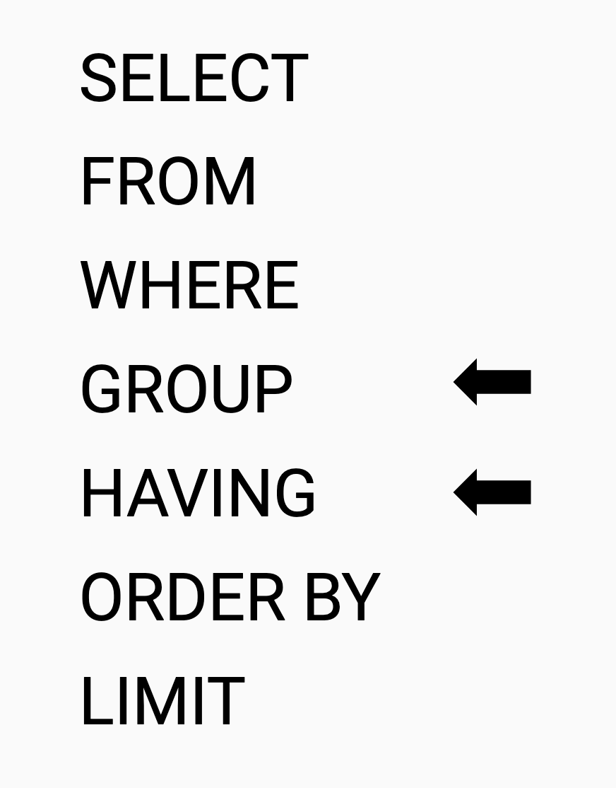

# Группировка данных в запросе
<!-- TODO поправь перевод -->

??? info "Подключение к базе данных"
    
    Для отработки запросов используйте тренажер<br>
    <br>
    ссылка: [http://mysqldognition.online/phpmyadmin/](http://mysqldognition.online/phpmyadmin/)<br>
    логин: student<br>
    пароль: n123456789

На данный момент вы узнали, как выбирать, переформатировать, манипулировать, упорядочивать и суммировать данные из одной таблицы в базе данных.  На этом уроке вы узнаете, как суммировать несколько подмножеств ваших данных в одном запросе.  Способ сделать это состоит в том, чтобы включить предложение "GROUP BY" в ваши SQL-запросы.



## GROUP BY для группировки результата запроса

Предложение GROUP BY легко включить в ваши запросы.  На самом деле, это может быть слишком просто включить в запросы MySQL, потому что это может быть неправильно использовано в запросах MySQL, даже если сообщение об ошибке не отображается.  Как следствие, я предлагаю вам проявлять разумную дозу осторожности каждый раз, когда вы используете предложение GROUP BY.  К концу этого урока вы поймете почему.  Однако при правильном использовании функция GROUP BY является одной из наиболее полезных и эффективных частей SQL-запроса, и как только вы освоитесь с ней, вы будете использовать ее очень часто.
<br><br>
Давайте вернемся к вопросу из упражнения 4 по MySQL.  Как бы вы запросили среднюю оценку для каждого из 40 тестов в таблице отзывов? Как мы уже обсуждали, одним из очень неэффективных способов сделать это было бы написать 40 отдельных запросов, каждый из которых имел бы другое имя теста в условном предложении WHERE.  Затем вы могли бы скопировать или расшифровать результаты всех 40 запросов в одном месте.  Но это было бы не очень приятно.  Вот как вы могли бы сделать то же самое, используя один запрос, содержащий предложение GROUP BY.

```SQL
SELECT test_name, AVG(rating) AS AVG_Rating
FROM reviews
GROUP BY test_name
```

Этот запрос выведет среднюю оценку для каждого теста.  Более технически, этот запрос даст указание MySQL усреднить все строки, которые имеют одинаковое значение в столбце test_name.

Обратите внимание, что я включил test_name в инструкцию SELECT.  В качестве строгого эмпирического правила, если вы группируете по столбцу, вы также должны включить этот столбец в инструкцию SELECT.  Если вы этого не сделаете, вы не будете знать, какой группе соответствует каждая строка вашего вывода.
Вы можете формировать группы, используя производные значения, а также исходные столбцы.  Чтобы проиллюстрировать это, давайте обратимся к другому вопросу: сколько тестов было выполнено в течение каждого месяца года?

Функция MONTH() вернет число, представляющее месяц ввода данных. Чтобы получить общее количество тестов, выполненных за каждый месяц, вы могли бы поместить функцию MONTH в предложение GROUP BY, в данном случае через псевдоним:

```SQL
SELECT test_name, MONTH(created_at) AS Month, COUNT(created_at) AS Num_Completed_Tests
FROM complete_tests
GROUP BY Month;
```
Вы также можете сгруппировать данные по нескольким столбцам или производным полям.  Если бы мы хотели определить общее количество тестов каждого типа, выполненных за каждый месяц, вы могли бы включить как "имя_теста", так и производное поле MONTH в предложение GROUP BY, разделенное запятой.

```SQL
SELECT test_name, MONTH(created_at) AS Month, COUNT(created_at) AS Num_Completed_Tests
FROM complete_tests
GROUP BY test_name, Month;
```

MySQL позволяет вам использовать псевдонимы в предложении GROUP BY, но некоторые системы баз данных этого не делают.  Если вы используете систему баз данных, которая не принимает псевдонимы в предложениях GROUP BY, вы все равно можете сгруппировать по производным полям, но вам придется дублировать вычисление для производного поля в предложении GROUP BY в дополнение к включению производного поля в предложение SELECT:

```SQL
SELECT test_name, MONTH(created_at) AS Month, COUNT(created_at) AS Num_Completed_Tests
FROM complete_tests
GROUP BY test_name, MONTH(created_at);
```

Обратите внимание, что в первом случае первый блок строк имеет одно и то же test_name, но разбит на отдельные месяцы.

<!-- TODO дополнить -->

```SQL
SELECT test_name, MONTH(created_at) AS Month, COUNT(created_at) AS Num_Completed_Tests
FROM complete_tests
GROUP BY test_name, Month
ORDER BY test_name ASC, Month ASC;
```

### Вопрос 1

**Составьте запрос, который выводит количество питомцев `dog_guid` девочек и мальчиков (значения в колонке `gender` _female_ и _male_) для каждой породы `breed` таблицы `dogs`, отсортированных по общему количеству собак в порядке убывания?**

<!-- TODO прододжить -->